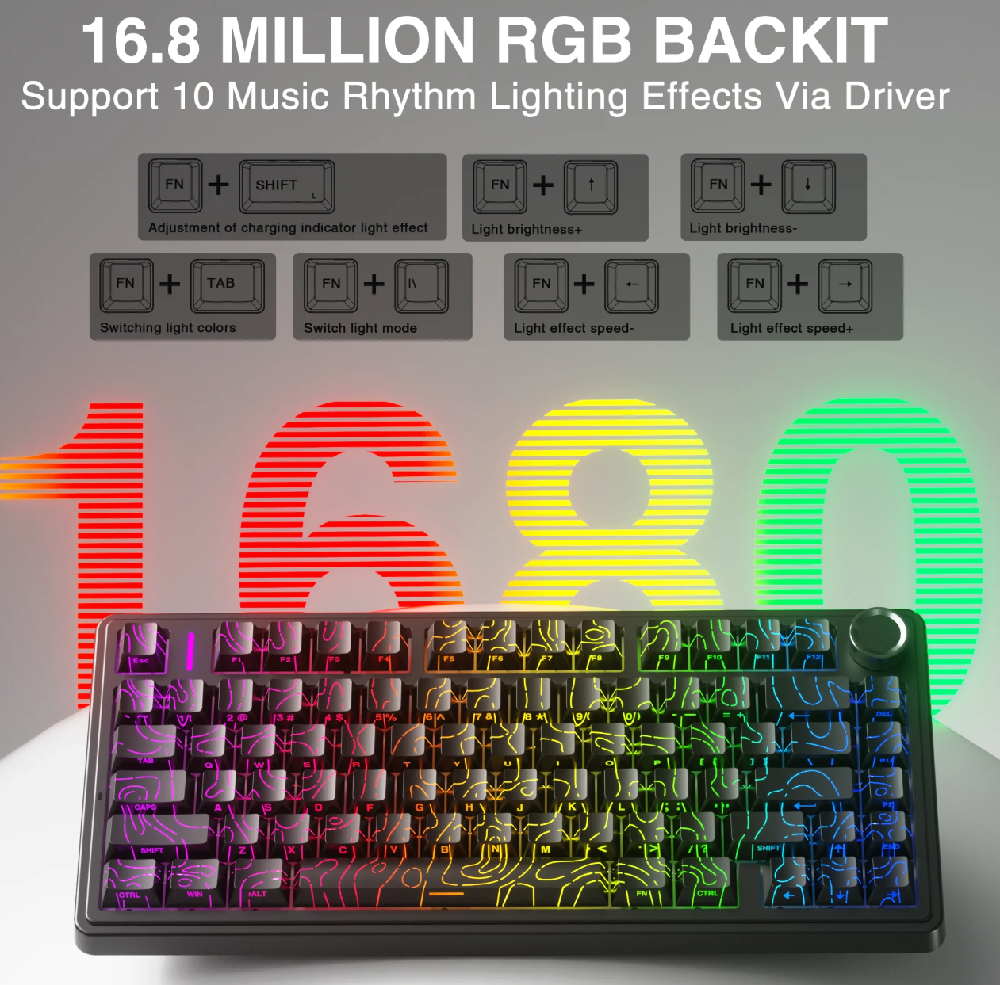
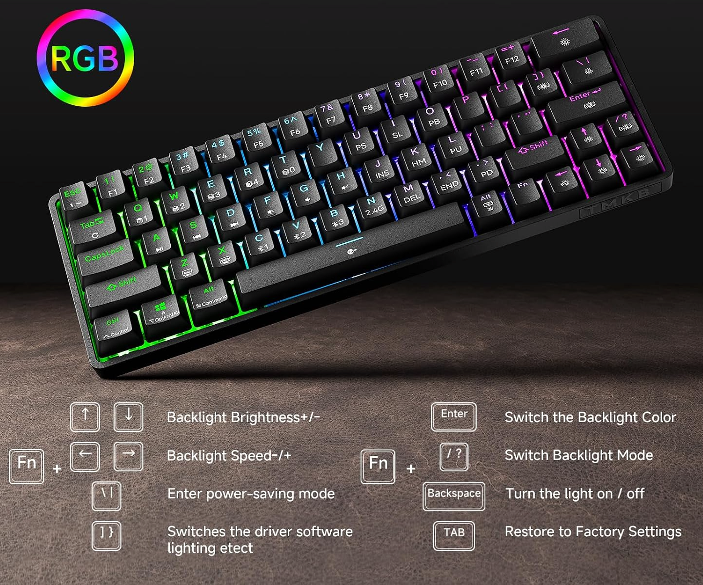
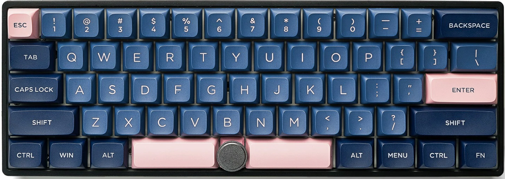

# Keyboards

## Keyd

    git clone https://github.com/rvaiya/keyd
    cd keyd
    make && sudo make install
    sudo systemctl enable --now keyd

* [/etc/keyd/default.conf](../configs/keyd-default.conf)

## Aula F75 Pad Mechanisch Toetsenbord, 75%

## TMKB T63 Gaming Wireless Keyboard,60%

## Skyloong GK61 PRO_48

* https://skyloong.vip/blogs/news/skyloong-gk61-pro-user-guide

* Open `chrome://device-log/`
* See which device has FILE_ERROR_ACCESS_DENIED
* If /dev/hidraw4, then `sudo chmod 777 /dev/hidraw4`

### Hard Reset (Unplug Method)

* If the keyboard is unresponsive, use this method:
* Unplug the USB cable from the keyboard.
* Hold down the ESC key.
* While holding ESC, plug the USB cable back in.
* Hold for about 5 seconds until the keyboard flashes.

## Via
* [Keyboard configuration](https://usevia.app/)  usevia.app

## Use via AppImage

    sudo apt install libfuse2

Download the latest version <https://github.com/the-via/releases/releases/>

    chmod +x via-*.AppImage
    ./via-3.0.0-linux.AppImage --no-sandbox

### Troubleshooting

* Go to chrome://settings/content/all
* Search for usevia.app
* Delete all data for that site
* Close and reopen the browser

Enable WebHID flag (if needed) Go to:

    Chrome: chrome://flags/#enable-experimental-web-platform-features

Set it to Enabled, then restart the browser.

## QMK Firmware
* [Basic keycodes](https://docs.qmk.fm/keycodes)

## Home Row Mods
* [A guide to home row mods](https://precondition.github.io/home-row-mods#using-home-row-mods-with-qmk)

## Layout sizes

Keyboard layout 60%

Keyboard layout 75%

Keyboard layout 80%

Keyboard layout 100%

