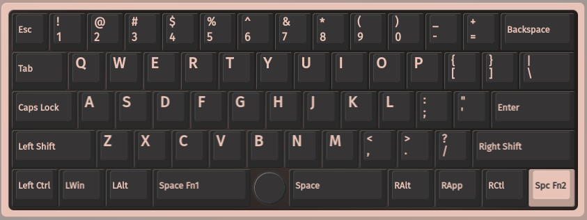
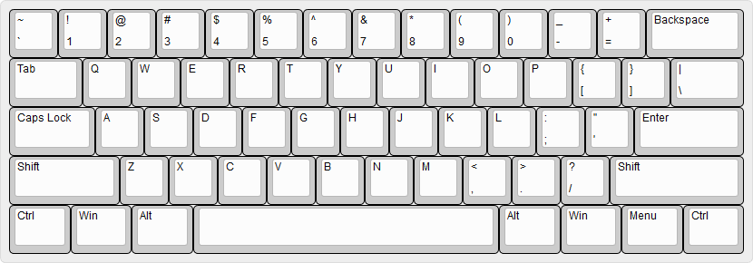

# Keyboards

## Via
* [Keyboard configuration](https://usevia.app/)  usevia.app

## Keychron K10 Max QMK Wireless Mechanical Keyboard

* <https://www.keychron.com/products/keychron-k10-max-qmk-wireless-mechanical-keyboard>
* <https://launcher.keychron.com/#/keymap>
* <https://www.keychron.com/blogs/news/how-to-use-launcher-to-program-your-keyboard>

## Skyloong GK61 PRO_48

* https://skyloong.vip/blogs/news/skyloong-gk61-pro-user-guide

* Open `chrome://device-log/`
* See which device has FILE_ERROR_ACCESS_DENIED
* If /dev/hidraw4, then `sudo chmod 777 /dev/hidraw4`

### My current layers

Layer 0

Layer 1

Layer 2

If you want to save the current layout (json) and using Brave as a browser you can get this
to work by activating the `brave://flags/#file-system-access-api` experimental flag.

## QMK Firmware
* [Basic keycodes](https://docs.qmk.fm/keycodes)

## Home Row Mods
* [A guide to home row mods](https://precondition.github.io/home-row-mods#using-home-row-mods-with-qmk)

## Layout sizes

Keyboard layout 60%

Keyboard layout 75%

Keyboard layout 80%

Keyboard layout 100%

